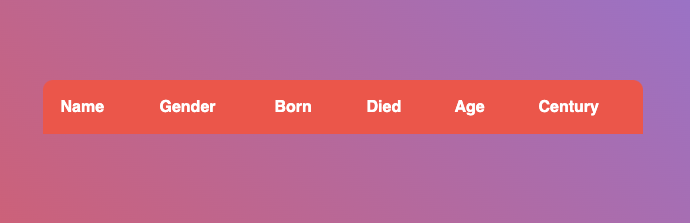

1. Replace `<your_account>` with your Github username in the link
    - [DEMO LINK](https://gord-oleg.github.io/js_task_generate_table_DOM/)
2. Follow [this instructions](https://mate-academy.github.io/layout_task-guideline/)
    - Run `npm run test` command to test your code;
    - Run `npm run test:only -- -n` to run fast test ignoring linter;
    - Run `npm run test:only -- -l` to run fast test with additional info in console ignoring linter.

### Task: Generate dashboard from JSON

This task requires knowledge of how HTML table works. You can learn it here:
 - [MDN HTML table basics](https://developer.mozilla.org/en-US/docs/Learn/HTML/Tables/Basics)

Okay, now we know what is a table, and can do some magic.
In `main.js`, you already have imported file `people.json`. Variable `people` contains an array of people, you can check it by using `console.log`.
Your task today is to convert this array to table rows.

Your layout for start: 

From the preview, you can see that table has 6 headers, but our data does not contain age and century. Yes, you need to calculate them by yourself.
 
##### Steps to do this challenge:
1) For each person from `people` array create table row with 6 table cells (name, gender, born, died, age, century)
2) Find a table with class `dashboard` in the document.
3) Append created row to table.
4) Done.

Hints:
- Age is `person.died - person.born`
- Century:divide year of person's death by 100 `Math.ceil(person.died / 100)`

Do not change styles or HTML layout in this task. Change only `main.js` file.

Expected result:

Гаразд, тепер ми знаємо, що таке стіл, і можемо творити трохи магії.
У `main.js` у вас уже є імпортований файл `people.json`. Змінна `people` містить масив людей, ви можете перевірити це за допомогою `console.log`.
Ваше сьогоднішнє завдання — перетворити цей масив на рядки таблиці.

Ваш макет для початку:

У попередньому перегляді ви можете побачити, що таблиця має 6 заголовків, але наші дані не містять вік і століття. Так, їх потрібно розрахувати самостійно.
 
##### Кроки для виконання цього завдання:
1) Для кожної особи з масиву `people` створіть рядок таблиці з 6 комірок таблиці (ім’я, стать, народився, помер, вік, століття)
2) Знайдіть у документі таблицю з класом `dashboard`.
3) Додайте створений рядок до таблиці.
4) Готово.

Підказки:
- Вік `person.died - person.born`
- Століття: розділіть рік смерті людини на 100 `Math.ceil(person.died / 100)`

Не змінюйте стилі чи макет HTML у цьому завданні. Змінити лише файл `main.js`.

Очікуваний результат:
